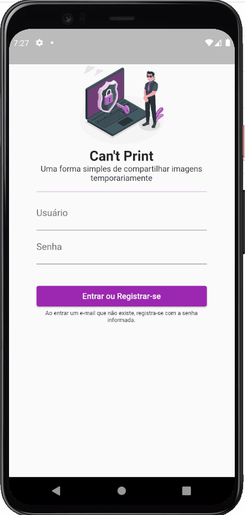

# Can't Print

O Can't Print é um app pensado para compartilhamento de imagens de forma controlada no ambiente empresarial. Conectado ao Firebase o gestor tem total controle do tráfego dessas mensagens.

Esse repositório é um material auxiliar para a apresentação da palestra **Flutter + Firebase: Resolvendo problemas com tecnologias da Google** apresentada no [TDC 2021](https://thedevconf.com/).

## 🔨 Características do projeto

Neste projeto, você será capaz de **Autenticar** um usuário, **Armazenar e compartilhar** imagens na nuvem.

## ✔️ Técnicas e tecnologias

**Para desenvolver o projeto, utilizamos as seguintes técnicas e tecnologias:**

- `Firebase Core`: Integração de um projeto Firebase com o Flutter.
- `Firebase Authenticator`: Ferramenta de autenticação do Firebase, usamos a opção de autenticação com Email e Senha.
- `Firebase Storage`: Ferramenta de armazenamento de arquivos na nuvem do Firebase.
- `Firebase Cloud Firestore`: Banco de dados na nuvem em tempo real do Firebase.

## 🛠️ Abrir e rodar o projeto

### Flutter

**Para executar este projeto, você precisa de:**

- Ter o [Flutter](https://flutter.dev/docs/get-started/install) instalado na sua máquina
- Ter algum editor de códigos ou IDE como o [Android Studio](https://developer.android.com/studio) ou [Intellij Idea](https://www.jetbrains.com/pt-br/idea/download/).

Caso opte por IDEs como as duas sugeridas acima, o processo de execução do aplicativo funcionará através de um botão de play na parte superior que ambas dispõem. Caso escolha rodar o projeto via linha de comandos, utilize o comando `flutter run`. Lembre-se de antes de executar o comando de navegar até a pasta do projeto antes.

Para mais instruções sobre a configuração do ambiente, recomendamos a leitura do artigo [Flutter - Como configurar o ambiente de desenvolvimento](https://www.alura.com.br/artigos/flutter-como-configurar-o-ambiente-de-desenvolvimento). Caso tenha desejo de obter conhecimento além dos cursos da [Formação Flutter](https://www.alura.com.br/formacao-flutter), recomendamos os livros [Iniciando com Flutter Framework](https://www.casadocodigo.com.br/products/livro-flutter) e [Aprofundando em Flutter](https://www.casadocodigo.com.br/products/livro-aprofundando-flutter) da editora [Casa do código](https://www.casadocodigo.com.br/).

### Firebase

- Criar um projeto no Firebase;
- Gerar um google-services.json usando o identificador: `com.example.flutter_cant_print`;
- Adicionar o arquivo google-services.json na pasta `android/app`.

## 🎇 Sugestões de Melhorias:

- Verificação da validade da imagem (no Listener ou usando Firebase Functions);
- Funcionalidade de visualização única (anotando ID de quem já visualizou no Firestore);
- Notificar quem recebe uma imagem (via Firebase Cloud Messaging);
- Gerar relatórios de erros e bugs (com Firebase Crashlytics);
- Imagens geram links diretos que redirecionam direto para o aplicativo (Firebase Dynamic Links);
- Versão para web (com Flutter Web e Firebase Hosting);
- Monetização através de anúncios (com Firebase AdMob).
